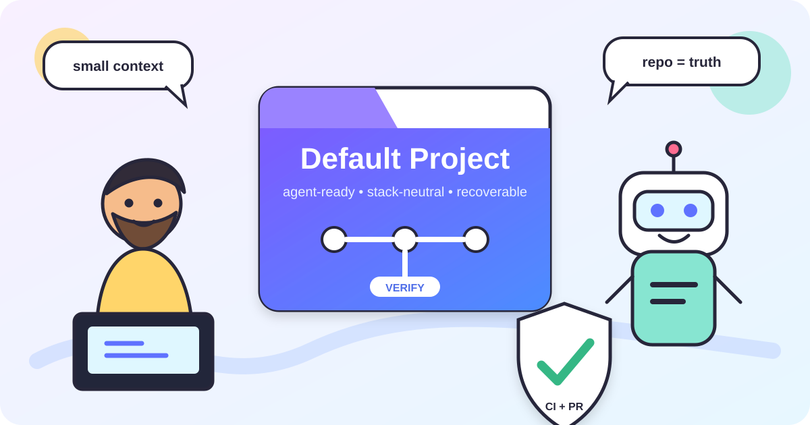
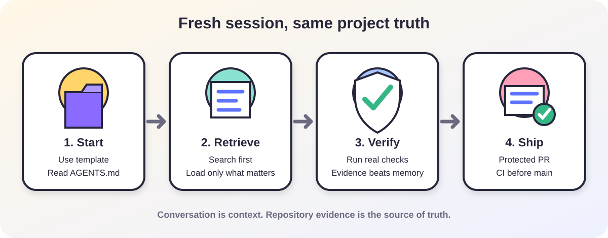

# Default Project

[](https://github.com/senoldogann/Default-project/actions/workflows/template-integrity.yml)
[](LICENSE)
[](CONTRIBUTING.md)
[](AGENTS.md)

A technology-agnostic **repository governance and context-recovery baseline** for long-lived, AI-assisted software projects.

**This is not an application starter kit.** It intentionally contains no framework, runtime, database, auth, UI, state-management, cloud, or product-architecture assumptions.

<p align="center">
  
</p>

> **One governance baseline. Any stack. Fresh agents recover project state from repository evidence instead of guessing from conversation history.**

## Why this exists

Long-running AI-assisted development usually fails in boring ways: stale chat context, invented project facts, forgotten decisions, gigantic instruction files, and agents confidently announcing tests they never ran. This baseline makes those failure modes harder by moving durable state into the repository and keeping always-on context deliberately small.

### What it optimizes for

- **Minimal always-on context** — one short canonical `AGENTS.md`, not a giant prompt manual.
- **Repository-backed truth** — code, tests, contracts, git, ADRs, and maintained docs outrank conversation memory.
- **Progressive disclosure** — agents search first and read deeper architecture, plans, and history only when relevant.
- **Cross-session recovery** — unfinished long tasks can leave a compact, verifiable handoff.
- **Evidence before confidence** — fixes and test results are reported only after verification.
- **Provider-neutral operation** — the core contract is not tied to a language, framework, model, or vendor.
- **Open-source friendly defaults** — MIT license, contribution/security policies, CODEOWNERS, issue/PR templates, dependency updates, and reusable repository-governance helpers.

## Architectural boundary

This repository deliberately stops at **agent/context/repository governance**.

Belongs here:

- agent operating and context rules,
- handoff, ADR, and execution-plan conventions,
- repository security and contribution policy,
- generic GitHub governance helpers,
- harness integrity checks.

Does **not** belong here:

- React, Next.js, Expo, FastAPI, Go service layouts, or other framework scaffolds,
- auth, databases, ORMs, state management, UI kits, cloud/provider assumptions,
- shared runtime code copied into every project,
- product-specific architecture.

Reusable runtime/configuration code should become a **versioned package**. Conditional project setup should become a **generator**. Repeated stack-specific application shapes should become narrowly named **archetypes**. This baseline should remain small and boring enough to fit almost anywhere.

## Start a new project

1. Use GitHub **Use this template** to create the new repository.
2. Replace this README with the project's product-facing README while preserving any baseline guidance that remains useful.
3. Keep root `AGENTS.md`; add only stable, high-value project rules.
4. Add architecture decisions to `docs/decisions/` and non-trivial active plans to `docs/plans/active/` only when genuinely useful.
5. Encode the project's real build/test/lint/typecheck commands in CI or repository scripts instead of teaching agents invented commands.
6. With GitHub CLI authenticated as a repository admin, apply the generic repository defaults:

```bash
bash scripts/setup-github-repository.sh owner/repository
```

7. Run `bash scripts/validate-template.sh` after changing the agent/repository harness itself.

The baseline intentionally does **not** guess your build system. A fresh agent discovers project-native commands from manifests, CI, scripts, and maintained docs.

### One-time setup for this canonical template repository

Maintainers of `senoldogann/Default-project` can configure the GitHub Template Repository flag, public metadata/topics, merge policy, security defaults, and branch ruleset with:

```bash
bash scripts/setup-github-repository.sh senoldogann/Default-project --template-origin
```

`--template-origin` is rejected for derived repositories so a project created from this template does not accidentally become another template origin.

## Baseline version and upgrades

The current repository baseline is recorded in `.agent/BASELINE_VERSION`.

GitHub template repositories are **snapshots**, not live parent/child dependencies. A derived repository should not blindly merge future template changes because its `AGENTS.md`, CI, architecture, and project rules may have legitimately diverged.

When the baseline evolves, selectively port useful security/governance improvements and update `.agent/BASELINE_VERSION` only after those changes are verified. The full policy is in [`docs/reliability/UPGRADING.md`](docs/reliability/UPGRADING.md).

This is how the project avoids the classic clone-and-own trap without pretending a GitHub template is a package manager.

## Fresh-session recovery

A new agent should normally recover state like this instead of asking for the old conversation:

```text
read AGENTS.md
      ↓
git status + recent git log
      ↓
read .agent/HANDOFF.md only if relevant and present
      ↓
inspect an active plan only if relevant and present
      ↓
search task-related code/tests/contracts/docs
      ↓
verify repository-native commands
      ↓
continue
```

The point is not to make the agent remember everything. The point is to make it cheap to find the right thing again.

<p align="center">
  
</p>

## Context budget

`AGENTS.md` is the canonical standing contract. CI enforces hard anti-bloat limits:

- `AGENTS.md`: **100 lines maximum** and **9,000 bytes maximum**.
- `CLAUDE.md`, `GEMINI.md`, `.github/copilot-instructions.md`: **1,024 bytes maximum each** and must point back to `AGENTS.md`.
- The rest of `docs/` is cold context and should be retrieved on demand.

These limits are guardrails, not targets. Shorter is better when the same behavior can be preserved.

## Repository map

| Path | Purpose | Load by default? |
| --- | --- | --- |
| `AGENTS.md` | Canonical agent operating contract and navigation map | Yes |
| `CLAUDE.md` | Thin Claude bootstrap | Tool-dependent |
| `GEMINI.md` | Thin Gemini bootstrap | Tool-dependent |
| `.github/copilot-instructions.md` | Thin Copilot bootstrap | Tool-dependent |
| `.agent/BASELINE_VERSION` | Snapshot version of the agent/repository baseline | No |
| `.agent/HANDOFF.md` | Temporary unfinished-work handoff, created only when needed | Only when relevant |
| `docs/architecture/` | Stable architecture maps and invariants | No |
| `docs/decisions/` | Durable ADRs | No |
| `docs/plans/active/` | Current non-trivial execution plans | No |
| `docs/plans/completed/` | Useful retained plan history | No |
| `docs/reliability/` | Verification, GitHub protection, and baseline-upgrade guidance | No |
| `scripts/checkpoint.sh` | Read-only git recovery snapshot | On demand |
| `scripts/validate-template.sh` | Harness integrity checks | On harness changes / CI |
| `scripts/setup-github-repository.sh` | Applies generic GitHub governance/security defaults | Once per repository / when policy changes |
| `scripts/apply-github-protections.sh` | Lower-level idempotent default-branch ruleset helper | Called by setup helper |
| `scripts/test-github-setup.sh` | Mocked behavior tests for GitHub setup/protection helpers | CI |

## Handoff lifecycle

Do **not** maintain a permanent transcript-shaped memory file. For unfinished work that genuinely needs another session, copy `.agent/HANDOFF.example.md` to `.agent/HANDOFF.md`, fill it with verified state, and keep it compact.

When the work finishes, delete the temporary handoff. Durable knowledge belongs with its owner: behavior in code/tests, decisions in ADRs, architecture in maintained docs, and implementation history in git/PRs.

## Plan and ADR rule of thumb

Use a plan when work spans multiple meaningful steps, sessions, or agents. Use an ADR when a choice has lasting architectural consequences. A one-line bug fix needs neither. Markdown quantity remains a surprisingly poor proxy for engineering quality.

## Verification helpers

### Compact checkpoint

```bash
bash scripts/checkpoint.sh
```

Prints repository root, branch, HEAD, worktree state, staged/unstaged diff summaries, and recent commits. It does not edit or commit anything.

### Harness integrity

```bash
bash scripts/validate-template.sh
```

Checks required harness files, baseline-version syntax, instruction-size limits, canonical provider bridges, newlines, and shell syntax.

### GitHub setup behavior

```bash
bash scripts/test-github-setup.sh
```

Uses a mocked GitHub CLI to verify that derived repositories receive generic governance/security settings while the canonical template-only metadata cannot leak into derived repositories.

Application tests are intentionally **not** guessed by these scripts. Each derived project should encode its real validation commands in CI or repository scripts, then let agents discover and execute those sources of truth.

## Open source and security

This repository is released under the [MIT License](LICENSE). Contributions are welcome; start with [CONTRIBUTING.md](CONTRIBUTING.md) and the [Code of Conduct](CODE_OF_CONDUCT.md).

Security-sensitive reports should follow [SECURITY.md](SECURITY.md). Please do not put vulnerability details or credentials into public issues, pull requests, screenshots, logs, or agent prompts.

For the current repository and repositories created from this template, the recommended default-branch ruleset is documented in [`docs/reliability/GITHUB_PROTECTIONS.md`](docs/reliability/GITHUB_PROTECTIONS.md). The setup helper configures a baseline that:

- requires changes to the default branch to arrive through a pull request,
- requires the `validate` status check on an up-to-date branch,
- requires review conversations to be resolved,
- requires linear history and squash-only merges,
- blocks force pushes and branch deletion,
- enables Dependabot alerts/security updates on public repositories when available,
- enables secret scanning and push protection on public repositories when available,
- enables private vulnerability reporting on public repositories when available.

The baseline does **not** require a separate approval because it is useful for solo maintainers too. Teams can raise the approval count and require CODEOWNER approval in the ruleset.

## Provider compatibility

The provider-neutral contract is root `AGENTS.md`. Tiny bootstrap files cover tools that discover provider-specific filenames without creating separate policy copies. GitHub Copilot supports repository/path-specific instructions and task-specific skills; add those only when a derived project has a genuine scoped need. Cursor supports root and nested `AGENTS.md` directly, so it needs no extra always-on rule file.

Other coding agents can use the same repository contract by reading `AGENTS.md` at session start. If a tool requires a different bootstrap filename, prefer a tiny pointer rather than duplicating the policy.

## Design basis

This structure is informed by public agent-engineering and repository-security guidance available on **2026-09-07**:

- OpenAI: repository knowledge as system of record, short `AGENTS.md`, structured execution plans, and progressive disclosure — https://openai.com/index/harness-engineering/
- OpenAI: externalized agent state and rehydration for durable long-running work — https://openai.com/index/the-next-evolution-of-the-agents-sdk/
- Anthropic: finite-context engineering, git/progress artifacts, structured handoffs, and independent evaluation for work that needs it — https://www.anthropic.com/engineering/effective-context-engineering-for-ai-agents and https://www.anthropic.com/engineering/harness-design-long-running-apps
- GitHub: template repositories are independent snapshots; rulesets provide PR/status-check/linear-history/force-push controls; public repositories can use Dependabot, secret protection, and private vulnerability reporting — https://docs.github.com/en/repositories/creating-and-managing-repositories/creating-a-repository-from-a-template and https://docs.github.com/en/repositories/configuring-branches-and-merges-in-your-repository/managing-rulesets/available-rules-for-rulesets
- Cursor: `AGENTS.md` as a project instruction format — https://cursor.com/docs/rules

The common idea is simple: preserve **high-signal durable state**, retrieve it selectively, verify outcomes in the environment, and keep reusable application code out of a generic governance baseline.

## License

MIT © 2026 Senol Dogan. See [LICENSE](LICENSE).
